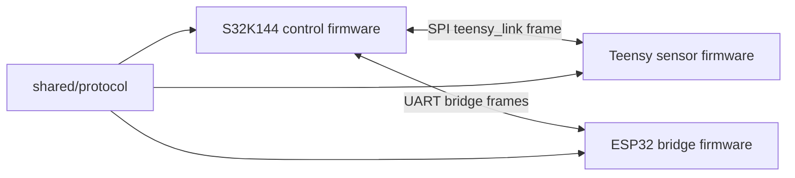

# NXP Cup Car Firmware

This site collects engineering documentation for the multi-board NXP Cup car
firmware repository.

## Main Areas

- S32K144 control firmware lives in `firmware/s32k144/`.
- Teensy firmware lives in `firmware/teensy/`.
- ESP32 firmware lives in `firmware/esp32/`.
- Shared cross-board packet contracts live in `shared/protocol/`.
- Hardware notes live in `hardware/`.

## Board Interaction

Start with the system and protocol pages, then use the board-specific README
files under `firmware/` for build and bring-up details.
