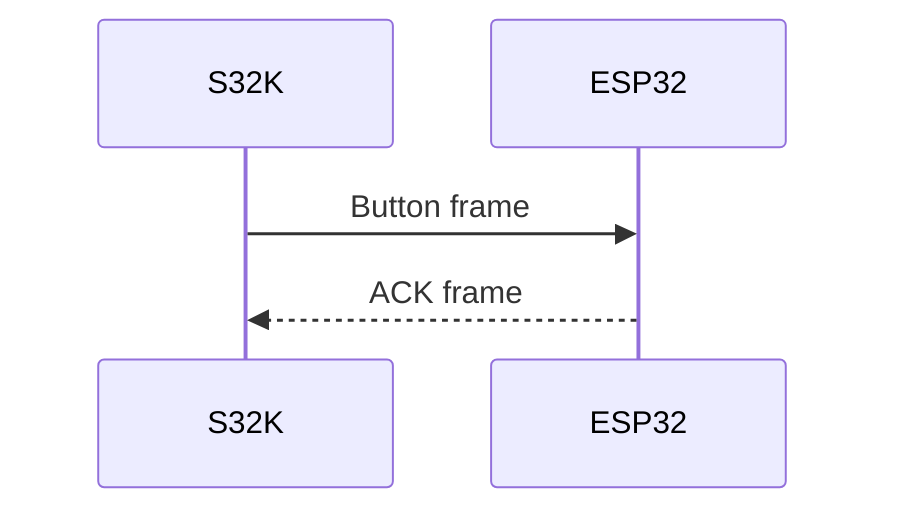

# MkDocs

MkDocs turns the Markdown files in `docs/` into a local engineering website.
The repository uses the Material theme and supports Mermaid diagrams inside
Markdown files.

## Commands

Use the PlatformIO Python environment on this workstation:

```powershell
C:\Users\misof\.platformio\penv\Scripts\python.exe -m mkdocs serve
```

Open the local URL printed by the command, usually:

```text
http://127.0.0.1:8000/
```

Build the static site without starting a server:

```powershell
C:\Users\misof\.platformio\penv\Scripts\python.exe -m mkdocs build
```

The generated site is written to `site/`. Do not commit that output directory.

## Adding Pages

1. Add a Markdown file under `docs/`.
2. Add the file to `mkdocs.yml` under `nav:`.
3. Run `mkdocs serve` to preview it.
4. Run `mkdocs build` before committing documentation changes.

## Mermaid Diagrams

Use Mermaid for simple architecture, sequence, and state diagrams:

````markdown

````

Keep diagrams factual. If hardware details or timing assumptions are unknown,
mark them as TODO instead of guessing.
